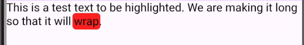

# Speech Highlighter

 ⚠️ This package is still under development. Do not use it for production


## How to use

1. Install the package (coming soon)

```bash
  flutter pub add speech_highlighter
```

2. Import the package

```dart
import 'package:speech_highlighter/speech_highlighter.dart';
```

3. Use it

```dart
SpeechHighlighter(
  key: highlighterKey,
  textToSpeak: ttsInput,
  decoration: const HighlightDecoration(
    color: Colors.red,
    borderRadius: Radius.circular(5),
  ),
)
```

## Interaction with the Text-to-Speech engine

1. Declare a global key for the [SpeechHighlighter] widget

```dart
final highlighterKey = GlobalKey<SpeechHighlighterState>();
```

2. Pass the key to the [SpeechHighlighter] widget

```dart
SpeechHighlighter(
  key: highlighterKey,
  textToSpeak: ttsInput,
  decoration: const HighlightDecoration(
    color: Colors.red,
    borderRadius: Radius.circular(5),
  ),
)
```

3. Call methods on the [SpeechHighlighter] widget

```dart
// Example: speak text
highlighterKey.currentState?.speakText();
```

## Contributing
Feel free to open an issue or PR if you have any questions or suggestions.
